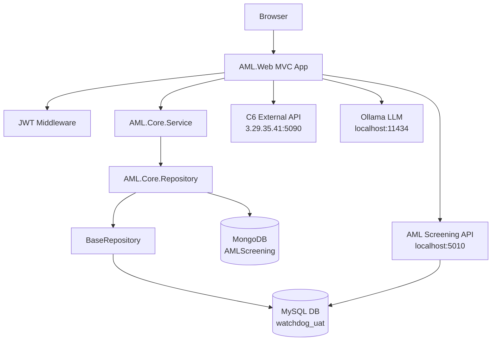

# Knowledge Graph — Lemon (Watchdog AML Platform)

> Last updated: 2026-05-26 | Commit: `abc6743`

---

## Architecture

---

## Project Structure

| Project | Type | Purpose |
|---------|------|---------|
| `AML.Web` | ASP.NET Core MVC | Main web application (entry point) |
| `AML.Core.Service` | Class Library | Business logic layer |
| `AML.Core.Repository` | Class Library | Data access (MySQL + MongoDB) |
| `AML.DTO` | Class Library | Shared Data Transfer Objects |
| `AML.ViewModel` | Class Library | View models for Razor views |
| `AML.Core.Common` | Class Library | Shared utilities, constants |
| `AML.OFAC` | Class Library | OFAC sanction list helpers |
| `APIScheduler/AML.Screening.API` | Standalone API | Name screening, scheduled jobs (port 5010) |
| `WatchDog/` | Static HTML | UI design prototypes (not production) |

---

## Domain Modules

| Module | Controller | Service | Repository | DB |
|--------|-----------|---------|------------|-----|
| **AML Cases** | CaseController | CustomerCaseService | CustomerCaseRepository | MySQL |
| **Internal Watchlist** | InternalWatchListController | InternalWatchListService | WatchListRepository + InternalWatchListMongoRepository | MySQL + MongoDB |
| **Risk (V2)** | RiskV2Controller | RiskV2Service | RiskV2Repository | MySQL |
| **KYC** | KycController | KycService | KycRepository | MySQL |
| **Proliferation Finance** | ProliferationFinanceController | ProliferationFinanceService | PFRepository + PFMongoRepository | MySQL + MongoDB |
| **EWRA** | EWRAController | EWRAService | EWRARepository | MySQL |
| **Transaction Monitoring** | TransactionMonitorController | TransactionMonitorService | TransactionMonitorRepository | MySQL |
| **Transaction Screening** | TransactionScreeningController | TransactionScreeningService | TransactionScreeningRepository | MySQL |
| **Users & Auth** | UserAccessController | AuthenticationService | AuthenticationRepository | MySQL |
| **Dashboard** | HomeController | CommonService | CommonRepository | MySQL |
| **AI Chat** | ChatController | MockAIService / ChatDataService | — | Ollama / RunPod |
| **Reports** | Reports/ | ReportService | ReportRepository | MySQL |
| **Customer Master** | CustomerController | CustomerMasterService | CustomerMasterRepository | MySQL |
| **Sanctions** | Sanction/ | SanctionService | SanctionRepository | MySQL |

---

## Key Views (Active / Recently Modified)

| View | Path | Notes |
|------|------|-------|
| `Shareholder_PDF.cshtml` | `Views/Case/` | **NEW.** PDF export for shareholder case (Tailwind + html2pdf.js, no layout) |
| `ProcessNew.cshtml` | `Views/Case/` | Legacy AdminLTE process view. Build-fixed (CS1503) |
| `Process.cshtml` | `Views/Case/` | Main case processing. SM = read-only. **Remarks model added for SM.** |
| `Process_PDF.cshtml` | `Views/Case/` | PDF print view — updated with Remarks/SM column |
| `Shareholder.cshtml` | `Views/Case/` | Shareholder repeater — Related Parties table column added |
| `Create.cshtml` | `Views/Case/` | Case creation. Datepicker fix + `*_Poa` fields for Authorised Signatories |
| `CorporateScreening.cshtml` | `Views/Corporate/` | Corporate screening — `*_Poa` fields added |
| `ViewIndividualCaseDetail.cshtml` | `Views/Report/` | Individual case report — Remarks display updated |
| `ViewIndividualCaseDetail_PDF.cshtml` | `Views/Report/` | PDF version — Remarks column added |
| `SanctionScreening/Index.cshtml` | `Views/SanctionScreening/` | Recently updated |
| `AdminLTE/_Layout.cshtml` | `Views/Shared/AdminLTE/` | Sidebar accordion expand/collapse enhanced |

---

## Infrastructure

| Resource | Detail |
|----------|--------|
| **MySQL** | `localhost:3306` / DB: `watchdog_uat_new_design_09032026` |
| **MongoDB** | `localhost:27017/AMLScreening` |
| **Screening API** | `https://localhost:5010/api/` (running: `dotnet run` in APIScheduler) |
| **C6 Screening** | `http://3.29.35.41:5090/` — threshold 75, toggled by `CallC6Screening` flag |
| **Ollama LLM** | `http://localhost:11434/` — Mistral 7B (8k context) |
| **RunPod AI** | Cloud fallback for AI endpoints |
| **File Storage** | `c:/amlstorage/upload` |
| **Logs** | NLog → `c:\temp\nlog-*.log` + `WebLogs.txt` |

---

## Auth & Security

- **Mechanism**: Custom JWT middleware (`JwtMiddleware`) — not ASP.NET Identity
- **Session**: Token stored in Session; validated on every request
- **Roles**: Resolved from MySQL `user_group` tables
- **RBAC**: `PageAuthorizeAttribute` (scoped filter) enforces page-level access
- **Risk Override**: Senior Management role only — `RiskV2` controller

---

## Key Architectural Decisions

| ADR | Decision | Why |
|-----|---------|-----|
| ADR-001 | Dual MySQL + MongoDB for Watchlist/PF | MySQL = queries; Mongo = flexible docs |
| ADR-002 | Custom JWT (not Identity) | Session-based, MySQL role resolution |
| ADR-003 | All repos extend `BaseRepository` | Centralizes SP execution, connection mgmt |
| ADR-004 | RiskV2 is active (Risk is legacy) | V2 adds override + audit trail |
| ADR-005 | `CallC6Screening` flag gates C6 API | Toggle paid external screening |
| ADR-006 | EPPlus for dynamic Excel templates | Sync with UI, includes dropdowns/validation |
| ADR-007 | Status=4 → Process.cshtml read-only | Senior Management submitted cases locked |

---

## Running Servers (as of 2026-04-16)

| Server | Command | Port |
|--------|---------|------|
| AML.Web | `dotnet run` in `AML.Web/` | Default (5000/5001) |
| AML.Screening.API | `dotnet run` in `Aml.Screening.Api/` | 5010 |

---

## Recent Commits

| SHA | Message |
|-----|---------|
| `fafc8ee` | Merge branch 'sanjana' |
| `f94012d` | Enhanced UI, Excel template of Blocklist, Added dropdown options for Override |
| `a5934fb` | Merge branch 'sanjana' |
| `c9e0c10` | Added risk parameters comments |
| `4a49867` | Fixed high risk badge coloring in ViewIndividualCaseDetail |
